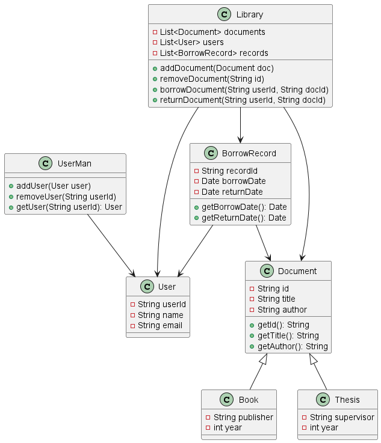

# NEW_BTLOOP - Library Management System

## 📌 Giới thiệu
Dự án **Library Management System** được xây dựng bằng **Java** và **JavaFX**, cho phép quản lý tài liệu, sách, luận văn, người dùng và các giao dịch mượn trả trong thư viện.

## ✨ Tính năng chính
- 📚 Quản lý tài liệu:
  - `Document` (Tài liệu chung)
  - `Book` (Sách)
  - `Thesis` (Luận văn)
- 👤 Quản lý người dùng (`User`, `UserMan`)
- 🏛️ Quản lý thư viện (`Library`)
  - Thêm / xóa tài liệu
  - Thêm / xóa người dùng
  - Cho mượn tài liệu
  - Trả tài liệu
  - Tìm kiếm tài liệu
- 📑 Quản lý phiếu mượn (`BorrowRecord`)

## 🗂️ Class Diagram


## 🎥 Video Demo
[▶️ Xem Video Demo](https://youtu.be/DS6LAtY3LWM)

## 🚀 Cách chạy dự án
1. Clone repo:
   ```bash
   git clone https://github.com/ThanhTrung286/NEW_BTLOOP.git
2. Cấu hình CSDL
   Cài đặt MySQL theo cấu hình mặc định.\
   Tạo người dùng "root" mật khẩu là "root".\
   Tạo CSDL MySql mới:
   ```bash
   mysql -u root -p
   ```
   ```mysql
   create database library
   use library
   exit
   ```
   Import tệp library.sql trong resource:
   ```bash
   mysql -u root -p library < library.sql
  3. Chạy lớp Main.java
